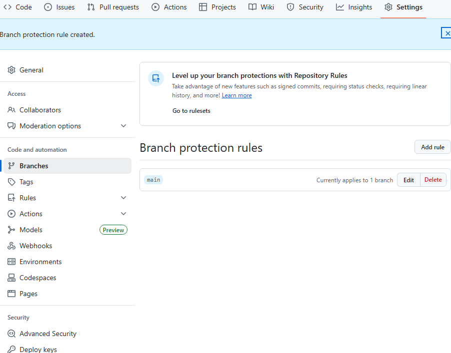
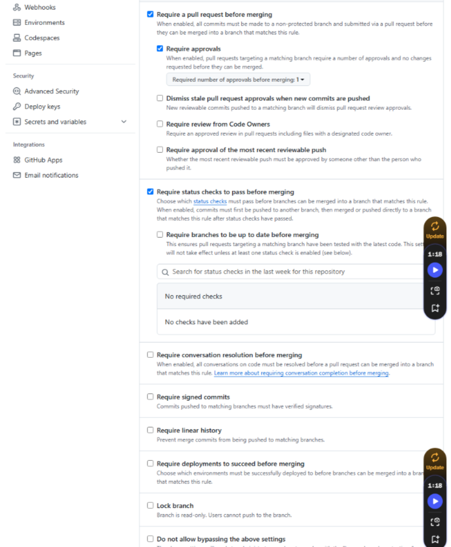
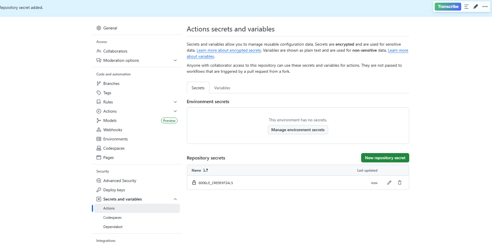
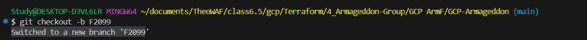

<h1 align="center">GCP ARMAGEDDON PROJECT</h1>


**Project Leader:** 
<a href="https://github.com/Charles-Roro">Charles CEO</a>


**Cloud Engineers:**
<a href="https://github.com/lynellg">Jody</a> , <a href="https://github.com/Futurist2099">Futurist</a> and <a href="https://github.com/Dejii2">DJ</a>

**DevSecOps:**
<a href="https://github.com/LarvariousM">Lavarious</a> and <a href="https://github.com/cloudninja365">Rod</a>

**Dev Tooling:**
<a href="https://github.com/KTMachine">Invictus</a>  and <a href="https://github.com/Brimah-Khalil-Kamara">Brimah</a>


**Floaters:**
Cleveland


<h4 align="center">GitActions CI/CD Pipeline for GCP Infrastructure. Automated Terraform deployment with simple SNYK security scan</h4>


---

<details>
  <summary>Table Of Contents</summary>

  - <a href="https://github.com/Melanated-Cyber-Kings/GCP-Armageddon/tree/main?tab=readme-ov-file#-about-the-project">About The Project</a>
  - <a href="https://github.com/Melanated-Cyber-Kings/GCP-Armageddon/tree/main?tab=readme-ov-file#-tools--technologies-used">Tools & Technologies Used</a>
  - <a href="https://github.com/Melanated-Cyber-Kings/GCP-Armageddon/tree/main?tab=readme-ov-file#-about-the-project">GCP Console Management</a>
      - <a href="https://github.com/Melanated-Cyber-Kings/GCP-Armageddon/tree/main?tab=readme-ov-file#step-1">1 Create GCP Cloud Storage Bucket:</a>
      - <a href="https://github.com/Melanated-Cyber-Kings/GCP-Armageddon/tree/main?tab=readme-ov-file#step-1">2 Create a Terraform Service Account:</a>
      - <a href="https://github.com/Melanated-Cyber-Kings/GCP-Armageddon/tree/main?tab=readme-ov-file#step-1">3 GCP Create Key:</a>  
  - <a href="https://github.com/Melanated-Cyber-Kings/GCP-Armageddon/tree/main?tab=readme-ov-file#instructions-before-starting-project">Instructions before starting Project</a>
      - <a href="https://github.com/Melanated-Cyber-Kings/GCP-Armageddon/tree/main?tab=readme-ov-file#step-1">Step 1: Branch protection rules to allow only pull requests to the main branch</a>  
      - <a href="https://github.com/Melanated-Cyber-Kings/GCP-Armageddon/tree/main?tab=readme-ov-file#step-2">Step 2: Get your secret in the repository to have your json key</a>
      - <a href="https://github.com/Melanated-Cyber-Kings/GCP-Armageddon/tree/main?tab=readme-ov-file#step-3">Step 3: Each member create a new branch that's not the main branch save changes into that new branch and push into github</a>
  - <a href="https://github.com/Melanated-Cyber-Kings/GCP-Armageddon/tree/main?tab=readme-ov-file#instructions-before-starting-project">Terraform Infrastructure Setup</a>
      - <a href="https://github.com/Melanated-Cyber-Kings/GCP-Armageddon/tree/main?tab=readme-ov-file#step-2">4 Create Repository:</a>
      - <a href="https://github.com/Melanated-Cyber-Kings/GCP-Armageddon/tree/main?tab=readme-ov-file#step-2">5 Connect local project with Git Repository:</a>
      - <a href="https://github.com/Melanated-Cyber-Kings/GCP-Armageddon/tree/main?tab=readme-ov-file#step-2">6 Create .gitignore:</a>
      - <a href="https://github.com/Melanated-Cyber-Kings/GCP-Armageddon/tree/main?tab=readme-ov-file#step-2">7 Check the remaining files in:</a>
      - <a href="https://github.com/Melanated-Cyber-Kings/GCP-Armageddon/tree/main?tab=readme-ov-file#step-2">8 Create Authentication File: (**Cloud Engineers:**
<a href="https://github.com/lynellg">**Jody**</a> , <a href="https://github.com/Futurist2099">**Futurist**</a> and <a href="https://github.com/Dejii2">**DJ**)</a></a>
      - <a href="https://github.com/Melanated-Cyber-Kings/GCP-Armageddon/tree/main?tab=readme-ov-file#step-2">9 Setup Remote Backend: (**Cloud Engineers:**
<a href="https://github.com/lynellg">**Jody**</a> , <a href="https://github.com/Futurist2099">**Futurist**</a> and <a href="https://github.com/Dejii2">**DJ**)</a></a>
      - <a href="https://github.com/Melanated-Cyber-Kings/GCP-Armageddon/tree/main?tab=readme-ov-file#step-2">10 Create VPC: (**Cloud Engineers:**
<a href="https://github.com/lynellg">**Jody**</a> , <a href="https://github.com/Futurist2099">**Futurist**</a> and <a href="https://github.com/Dejii2">**DJ**)</a></a>
      - <a href="https://github.com/Melanated-Cyber-Kings/GCP-Armageddon/tree/main?tab=readme-ov-file#step-2">11 Terraform Workflow: (**Dev Tooling:**
<a href="https://github.com/KTMachine">**Invictus**</a> and <a href="https://github.com/Brimah-Khalil-Kamara">**Brimah**)</a></a>
      - <a href="https://github.com/Melanated-Cyber-Kings/GCP-Armageddon/tree/main?tab=readme-ov-file#step-2">12 SNYK Configuration: (**DevSecOps:**
<a href="https://github.com/LarvariousM">**Lavarious**</a> and <a href="https://github.com/cloudninja365">**Rod**)</a></a>


      


</details>

<br>

<br>

<h2 align="center">📌 About The Project</h2>

<br>

This project shows how to connect your GCP Project to Github actions and run terraform to run a simple SNYK security scan. Although the objective is to run a simple SNYK scan, GCP infrastructure can still be spun up automatically instead of using the GCP console or gcloud CLI. 

<br>

<br>

<h2 align="center">🛠 Tools & Technologies Used</h2>

<br>

- Terraform  (_Infrastructure as Code to provision GCP networking resources_)  
- GCP  (_VPC, Subnets, NAT Gateway, Router, and Storage Bucket_)  
- GitHub  (_Source control for Terraform scripts, including workflows_) 
- terraform.yaml workflows script
- snyk.yaml workflows script

<br>

<h2 align="center">💻 GCP Console Management</h2>

<br>

Before we begin on Terraform and building the basic infrastructure we must first do some initial GCP console management

<br>

<h2>1 Create GCP Cloud Storage Bucket:</h2>

<br>

To create buckets you can either create on on the fly or use an existing bucket if there is one available. [Create a new bucket](https://cloud.google.com/storage/docs/creating-buckets) In the GCP console type in buckets in the search area and select "Buckets cloud storage". Once in the buckets dashboard area select "create a bucket". In this area you select a name for your bucket and the region to where you want your data stored. Follow the dialogue and select create.

<br>

<h2>2 Create a Terraform Service Account:</h2>


<br>

<h2>3 GCP Create Key:</h2>

<br>

<br>


<h2 align="center">🧾Instructions before starting Project</h2>

<br>

<h3>Step 1:  Branch protection rules to allow only pull requests to the main branch</h3>


- Go to your repo on Github
- Click on the Settings Link
- In the left sidebar, click Branches
- Under Branch protection rules, click "Add rule"
- In Branch name pattern type, check the following boxes:
- Require a pull request before merging
  - Require approvals (optional, but recommended)
    - Require status checks to pass (optional, if you have CI/CD)
    - Include administrators (optional)
    - Click Create at the bottom
   
<h2></h2>

<br>
   
<div align="center">
  
</div>


<div align="center">
  
</div>

<h2></h2>


<h3>Step 2: Get your secret in the repository to have your json key</h3>  

<br>

Open GitHub, go to your Repo's settings, and add a secret called "GOOGLE_CREDENTIALS". Your repo will use this to connect to GCP and run the terraform scripts. You need storage access, terraform needs to save it's states in a bucket. This prevents it from running into issues by attempting to create objests that already exist.

<br>

<div align="center">
  
</div>

<br>

<h3>Step 3: Each member create a new branch that's not the main branch save changes into that new branch and push into github</h3> 

<br>

To create your own branch locally use the command **git checkout -b <"Your branch name">**. This will go from the main branch to your new branch. You can verify this by using the commandd **git branch**. All project team memebers must create their own branch save changes to it and push into github.

<br>

<div align="center">
  
</div>

<br>

<br>

<h2 align="center">📂Terraform Infrastructure Setup</h2>

<br>


<h2>4 Create Repository:</h2>


Create a Git repository for the terraform project so whatever changes made to the terraform configuration, can actually work with the repository, so there’s a history of the changes and also other team members can check out the code and work on the same project as well. 

<br>


<br>
<br>

<h2>5 Connect local project with Git Repository:</h2>


In this instance because we cloned a GitHub repo that we created (i.e., the repo is already on GitHub), then Git is already set up with the remote (origin) — so you don't need to run git remote add.
However, if you create your project locally and started with the command **git init** not cloned this means its not connected to a github repo so you would have to copy the url of your repo in the "Code" drop down. Then you can go into VScode and remote into the repo from your local device. The command you'll need to run in our VSCode terminal is **git remote add origin <your_repos_url>"**. Essentially what this command is saying is "Connect your local project to a GitHub repository (or another remote repo) so you can push code there.

The remote repository exists in Github now the local project can be connected to the remote repository. Which means we are going to make it into a Git project. In gitbash in the right folder project path  the git init command is used.

```bash
git init
```

What this does is it initialises an empty repository. To connect it to remote to push the existing repository the git remote add origin command is used.

```bash
git remote add origin https://github.com/Brimah-Khalil-Kamara/terraformGCP.git
```

<br>


<br>

<br>

<h2></h2>

<br>

<h2>6 Create .gitignore:</h2>

The thing is we don’t need to check all these files to the repository some of these files shouldn’t be checked in to the repository

So were not going to check the **.terraform** folder which basically just stores the providers that are installed locally so it doesn’t have to be part of the code. When we do a **terraform init** this will be downloaded on your computer locally. 

**terraform.tfstate** is another folder we want to ignore. It is a generated file that gets updated every time we do a **terraform apply.** We also want to ignore the backup file

In addition to this the json GCP private key information is sensitive as we dont want this in our repo so to omit the **.json** file adding it to the gitignore.


The git status command is ran, we can see all the files we ignored are not on the list, but we have the gitignore file.


```bash
git status
```

Each Project team member after creating their respected branches can follow a typical workflow. You can either clone the repo as mentioned previously or create files for the project locally and push to your created branch. This typical workflow involves the following commands

<br>

Make changes or add files
**git add .** 

<br>

Commit the changes
**git commit -m "your comment here"**

<br>

Push to Github
**git push origin <"your branch name here>**


<br>

<h2>7 Check the remaining files in:</h2>

To push the files remotely to the github Repository created from our local computer we use the following commands.


```bash
git add .
```

```bash
git commit -m "initial commit"
```

```bash
git push -u origin main
```

The changes have been pushed to the remote repository and we can check this in the UI

<h2></h2>


<h2>8 Create Authentication File: (Cloud Engineers:
<a href="https://github.com/lynellg">Jody</a> , <a href="https://github.com/Futurist2099">Futurist</a> and <a href="https://github.com/Dejii2">DJ</a>)</h2>

In order for terraform to authenticate to Google Cloud an authentication file is needed, making use of the key created and downloaded locally above.

Using VS code an authentication file is created. [0-authentication.tf](https://github.com/Melanated-Cyber-Kings/GCP-Armageddon/blob/main/0-authentication.tf)
In this instance the provider is Google, The project is the Project worked from, the region, and the credentials is the json file that you download locally to your computer for authentication.
<h2></h2>

Replace the Service Account key file, project, and region with your own credentials

```hcl
provider "google" {
  credentials = file("<KEY-FILE>.json")
  project     = "<PROJECT-ID>"
  region      = "<SELECTED-REGION>"
}
```
[Google Provider reference](https://registry.terraform.io/providers/hashicorp/google/latest/docs/guides/provider_reference)

<h2></h2>

<h2>9 Setup Remote Backend: (Cloud Engineers:
<a href="https://github.com/lynellg">Jody</a> , <a href="https://github.com/Futurist2099">Futurist</a> and <a href="https://github.com/Dejii2">DJ</a>)</h2>

In VS code a file named [1-backend.tf](https://github.com/Melanated-Cyber-Kings/GCP-Armageddon/blob/main/01-backend.tf) is created.

The following configuration is added to the 1-backend.tf file. Where gcs denotes google cloud storage, bucket is the name of the previous bucket created. 

```hcl
terraform {
backend "gcs" {
bucket = "<BUCKET-NAME>"
prefix = "terraform/state"
}
}
```
<h2></h2>

In addition added is the credentials.

<h2></h2>

<h2>10 Create VPC: (Cloud Engineers:
<a href="https://github.com/lynellg">Jody</a> , <a href="https://github.com/Futurist2099">Futurist</a> and <a href="https://github.com/Dejii2">DJ</a>)</h2>

The VPC will allow you to define your network infrastucture.

In VS code a file named [2-vpc.tf](https://github.com/Melanated-Cyber-Kings/GCP-Armageddon/blob/main/02-vpc.tf) is created. You can add the following configuration to the 2-vpc.tf file define your own VPC

```hcl
resource "google_compute_network" "vpc_network" {
    name                    = "my-vpc"
    auto_create_subnetworks = true
}
```
<h2></h2>

<h2>11 Terraform Workflow: (Dev Tooling:
<a href="https://github.com/KTMachine">Invictus</a> and <a href="https://github.com/Brimah-Khalil-Kamara">Brimah</a>)</h2>

Once our basic infrastructure has been configured, we can begin to execute terraform commands in our terminal

<h2>


 
</h2>

<h2>12 SNYK Configuration: (DevSecOps:
<a href="https://github.com/LarvariousM">Lavarious</a> and <a href="https://github.com/cloudninja365">Rod</a>)</h2>


